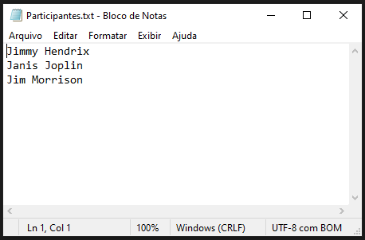
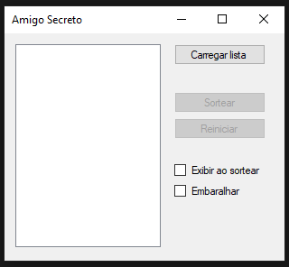
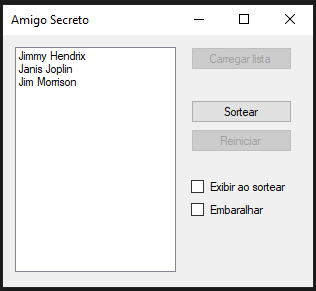

# Amigo Secreto 😏

## Necessidade 🤷‍♂️
Projeto surgiu de uma necessidade da minha família, pois era comum fazer um "Amigo Secreto" no final do ano, porém era necessário reunir todos os participantes para realizar o sorteio. Contudo com o tempo essa reunião prévia ficou cada vez mais difícil de ocorrer.

## Solução ⚡
Como o problema era estar presente para sortear o nome e verificar se não havia sorteado a si mesmo, criei uma forma de sortear os nomes dos participantes evitando o 'auto-sorteio'.
Para que o operador não saiba quem está sendo sorteado, os nomes são salvos em um arquivo texto com o nome do participante que 'pegou o nome' no sorteio.

Após realizado o sorteio bastava enviar os arquivos texto por e-mail para cada participante, dessa forma só o receptor saberia o conteúdo do arquivo (a menos que o operador quebrasse o sigilo e abrisse os arquivos).

## Versões 🖍️

### Versão 0
Para utilizar a versão "zero":
- Abra o arquivo "Participantes.txt" (que deverá estar junto ao arquivo executável) e atualize os nomes dos participantes do sorteio

- Execute o aplicativo

- Clique no botão "Carregar Lista" para o os nomes do arquivo sejam carregados

- Clique no botão "Sortear", será criada uma pasta com o nome "SorteioAAAAMMDD-hhmmss" (onde AAAAMMDD-hhmmss é a data e hora do evento) e dentro dela estarão os arquivos com os nomes dos particiantes

- Cada arquivo conterá o nome que o participante sorteou.

#### Opções especiais

- Exibir ao sortear
    - Esta opção serve para que o operador posso "ver" cada participante sorteado, quebrando o sigilo do sorteio. 
    - Só deve ser utilizado quando o operador não for participar do sorteio!
- Embaralhar 
    - Quando essa opção não estiver selecionada o sorteio ocorre na ordem em que a lista foi carregada, onde o primeio nome sorteia algum outro nome da lista, depois o segundo nome e assim por diante. 
    - Quando estiver selecionada, o sorteio irá ocorrer de forma aleatória, onde primeiro será escolhido um dos participantes da lista (não necessariamente o primeiro) para sortear um dos nomes.

### Versão 1
